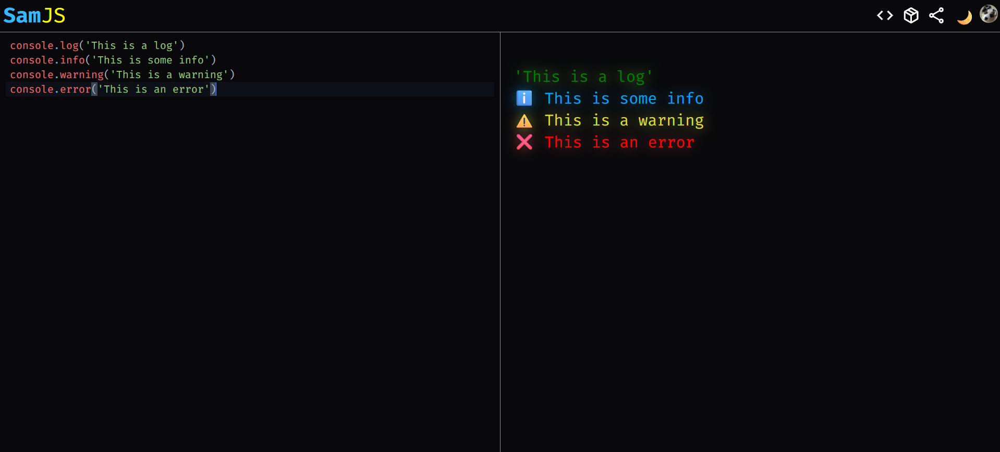

# [SamJS](https://samjs.vercel.app)

SamJS is an **Open Source** in-real-time JavaScript runner for
testing and prototyping your JS code.

<details>
  <summary>📚 Table of contents</summary>

- [SamJS](#samjs)
  - [Functionalities:](#functionalities)
  - [Import modules](#import-modules)
  - [Use `fetch`](#use-fetch)
  - [Use the console methods -\> `log`, `info`, `warning`, `error`](#use-the-console-methods---log-info-warning-error)
  - [Change the theme](#change-the-theme)
    - [Dark mode](#dark-mode)
    - [Light mode](#light-mode)

</details>
<br>


## Functionalities:

- **Instant** run the code when it's modificated
- **Async functions** like `fetch` or your custom ones
- **Import libraries** using the `require` method
- **Code autocomplanation** while you type

## Import modules

You can **import modules** in your program by using the method `required`, it takes one parameter: the url of the hosted library. An example:

```javascript
const rw = await require('https://esm.sh/random-words@1.1.2')
console.log(rw['wordList'])
```

> [!NOTE]
> You can only import libraries wich use [ECMAScript](https://developer.mozilla.org/en-US/docs/Web/JavaScript/Guide/Modules) modules

## Use `fetch`

You can also use the method `fetch` in SamJS, for using it correctly, follow this structure:

```javascript
fetch(<url>)
    .then(res => <action>)
```

Otherwise, you will get an empty object (`{}`) as the response.

An example calling the pokeapi:

```javascript
fetch('https://pokeapi.co/api/v2/pokemon/ditto')
   .then(res => res.json())
   .then(response => console.log(response.name)) // Prints 'ditto'
```

## Use the console methods -> `log`, `info`, `warning`, `error`

SamJS supports **four different** print methods:

```javascript
console.log('This is a log')
console.info('This is some info')
console.warning('This is a warning')
console.error('This is an error')
```

The last example in the app:



## Change the theme

You can switch between dark and light modes by pressing the theme button:


### Dark mode


### Light mode


