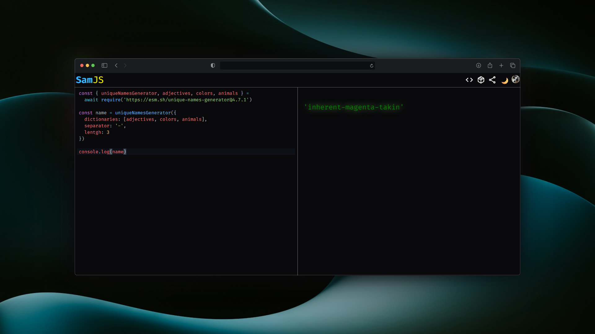
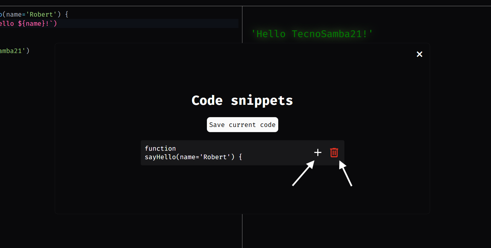

# [SamJS](https://samjs.vercel.app)

[](https://deepwiki.com/Tecnosamba21/SamJS)

SamJS is an **Open Source** in-real-time JavaScript runner for
testing and prototyping your JS code.

<details>
  <summary>📚 Table of contents</summary>

- [SamJS](#samjs)
  - [Functionalities:](#functionalities)
  - [Import modules](#import-modules)
  - [Use `fetch`](#use-fetch)
  - [Use the console methods -\> `log`, `info`, `warning`, `error`](#use-the-console-methods---log-info-warning-error)
  - [Change the theme](#change-the-theme)
    - [Dark mode](#dark-mode)
    - [Light mode](#light-mode)
  - [Search packages](#search-packages)
  - [Share your code](#share-your-code)
  - [Account](#account)
    - [Creating an account](#creating-an-account)
  - [Managing your account](#managing-your-account)
  - [Save code snippets](#save-code-snippets)

</details>
<br>



## Functionalities:

- **Instant** run the code when it's modificated
- **Async functions** like `fetch` or your custom ones
- **Import libraries** using the `require` method
- **Code autocomplanation** while you type
- **Package searching** with access to all npm
- **Share your code** by a url
- **Save code snippets** if you log in

## Import modules

You can **import modules** in your program by using the async method `require`:

```javascript
require(<url>) -> Promise(<library>)
```

An example importing `random-words`:

```javascript
const rw = await require('https://esm.sh/random-words@1.1.2')
console.log(rw['wordList'])
```

[Open in SamJS 🔌](https://samjs.vercel.app?c=Y29uc3QlMjBydyUyMCUzRCUyMGF3YWl0JTIwcmVxdWlyZSgnaHR0cHMlM0ElMkYlMkZlc20uc2glMkZyYW5kb20td29yZHMlNDAxLjEuMicpJTBBY29uc29sZS5sb2cocnclNUInd29yZExpc3QnJTVEKQ==)

> [!NOTE]
> You can only import libraries wich use [ECMAScript](https://developer.mozilla.org/en-US/docs/Web/JavaScript/Guide/Modules) modules

## Use `fetch`

You can also use the method `fetch` in SamJS, for using it correctly, follow this structure:

```javascript
fetch(<url>)
    .then(res => <action>)
```

Otherwise, you will get an empty object (`{}`) as the response.

An example calling the *pokeapi*:

```javascript
fetch('https://pokeapi.co/api/v2/pokemon/ditto')
   .then(res => res.json())
   .then(response => console.log(response.name)) // Prints 'ditto'
```

[Open in SamJS 🔌](https://samjs.vercel.app?c=ZmV0Y2goJ2h0dHBzJTNBJTJGJTJGcG9rZWFwaS5jbyUyRmFwaSUyRnYyJTJGcG9rZW1vbiUyRmRpdHRvJyklMEElMjAlMjAlMjAudGhlbihyZXMlMjAlM0QlM0UlMjByZXMuanNvbigpKSUwQSUyMCUyMCUyMC50aGVuKHJlc3BvbnNlJTIwJTNEJTNFJTIwY29uc29sZS5sb2cocmVzcG9uc2UubmFtZSkp)

## Use the console methods -> `log`, `info`, `warning`, `error`

SamJS supports **four different** print methods:

```javascript
console.log('This is a log')
console.info('This is some info')
console.warning('This is a warning')
console.error('This is an error')
```

[Open in SamJS 🔌](https://samjs.vercel.app?c=Y29uc29sZS5sb2coJ1RoaXMlMjBpcyUyMGElMjBsb2cnKSUwQWNvbnNvbGUuaW5mbygnVGhpcyUyMGlzJTIwc29tZSUyMGluZm8nKSUwQWNvbnNvbGUud2FybmluZygnVGhpcyUyMGlzJTIwYSUyMHdhcm5pbmcnKSUwQWNvbnNvbGUuZXJyb3IoJ1RoaXMlMjBpcyUyMGFuJTIwZXJyb3InKQ==)

The example in the app:


## Change the theme

You can switch between dark and light modes by pressing the theme button:


### Dark mode


### Light mode


## Search packages

By using the method `require` you can import packages very easily. And you can look for them easily as well!

Just press the package searching button and a dialog will be displayed:


## Share your code

Do you want to show your code to your friends or team? Just copy the shareable url and send it to them.


## Account

SamJS has a **completely free** account system that allows you to save your code in snippets. It uses *[Clerk](https://clerk.com)* for the authentication and *[Supabase](https://supabase.com)* for the code storage.

### Creating an account

For creating an account press the *Log In* button:


You will be redirected to a Log In page. Press the *Sign Up* link:


When clicked, choose one of the three account options:

- **Github**
- **Google**
- **Email** (you will have to confirm the email adress)


## Managing your account

Press the account button (your account avatar) and then *Manage account*:


When pressed, you will see a dialog where you can change your account settings:


## Save code snippets

> [!NOTE]
> You must be **logged in** in order yo use this function, otherwise the access button will be disabled. Also keep in mind that there is a limit of four snippets per account for ensuring everybody to have free space for their snippets.

Press the *code snippets* button and then *Save current code* for saving the code of the editor as a snippet.


When it is uploaded a `section` will appear with the first line of the saved code:


If you hover the `section` element two buttons will appear:

- **Add to the current code**: for adding the content of the snippet to the editor.
- **Remove snippet**: for removing the snippet from the list.

Also, if you click the `section` the code of the editor will be replaced by the content of the snippet.



> [!TIP]
> For adding a title to the snippet add a comment at the beginning of your code with it